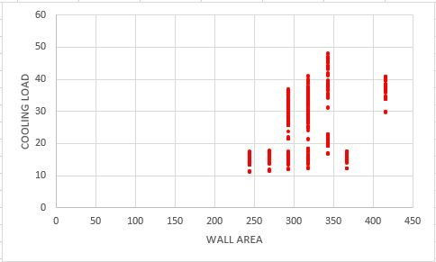
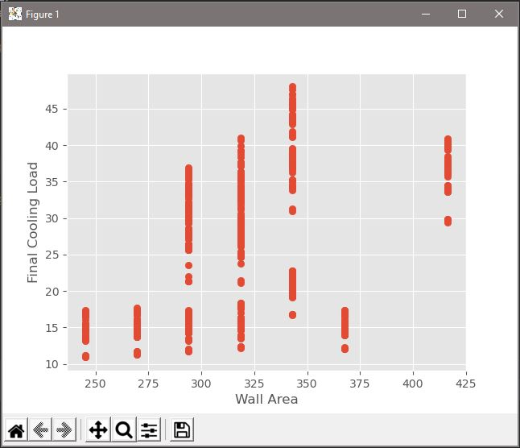
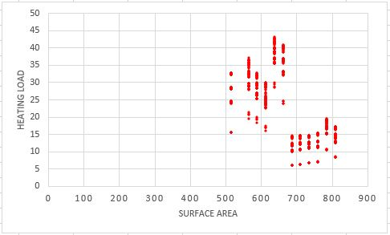
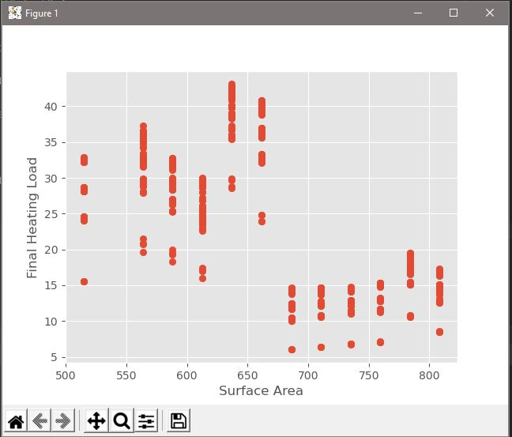

## Energy Efficiency Machine Learning Model

### Project Overview-
---

The follwing M.L. models aim to develop heating and cooling load requirements for buildings from their construction parameters.
Using Tensorflow, Sklearn, and Pandas in a Conda Environment, the goal of this model was to simulate a comparable 
"Line of best fit" to that of real world conditions while training on only 10% of the following dataset: https://archive.ics.uci.edu/ml/datasets/Energy+efficiency
There are 2 working programs, one calculating cooling requirements, the other finding heating.

---

### Program Outline-

The program workflow begins by reading in the dataset via a .csv formatting and creating two arrays from the dataset;
one for attributes and one for labels. (Heating and Cooling Load outcomes.) By utilizing the Linear Regression function from Sklearn,
the M.L. model can be tested 30 different times for a cumulative accuracy with a For Loop. 
The following If statement uses the Pickle Module to write and save that model to the working directory if its accuracy beats its predecessor.
Finally, the model is portrayed with Matplotlib styling.

---

## Analysis-
### Cooling Load:
#### Wall Area: (Positive Correlation)
Dataset-

Model-

---
### Heating Load:
#### Surface Area: (Negative Correlation)
Dataset-

Model-

---
## Notes-

I have included the rest of the outputs from each attribute as .jpeg's here: https://github.com/wisenickel5/Energy-Efficiency/tree/master/Project_imgs
It should be noted that this data was produced with artificially produced with an architectural  simulation tool. 
A majority of the code is commented out so anyone can follow along. 
